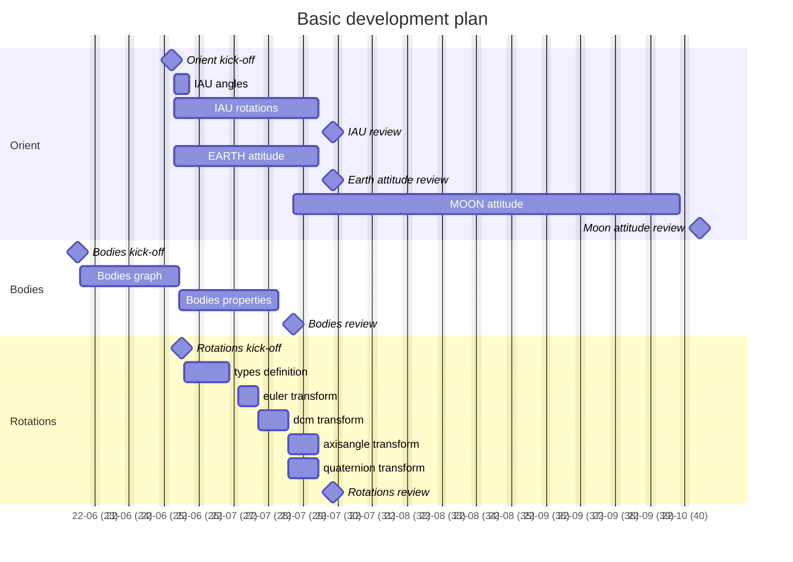

```mermaid
gantt

dateFormat  YYYY-MM-DD
axisFormat  %y-%m (%U)
title       Basic development plan
excludes    weekends

section Orient 
Orient kick-off                 :milestone,            or1, 2022-06-20, 1d
IAU angles                      :                      ori1, after or1, 3d 
IAU rotations                   :                      ori2, after or1, 3w
IAU review                      :milestone,            or2, after ori2, 4d
EARTH attitude                  :                      ori3, after or1, 3w
Earth attitude review           :milestone,            or3, after ori3, 4d
MOON attitude                   :                      ori4, 2022-07-15, 8w
Moon attitude review            :milestone,            or4, after ori4, 4d

section Bodies
Bodies kick-off                 :milestone,            b1, 2022-06-01, 1d
Bodies graph                    :                      bod1, after b1, 2w
Bodies properties               :                      bod2, after bod1, 2w
Bodies review                   :milestone,            b2, after bod2, 4d

section Rotations 
Rotations kick-off              :milestone,            r1, 2022-06-22, 1d 
types definition                :                      rot1, after r1, 1w 
euler transform                 :                      rot2, after rot1, 4d
dcm transform                   :                      rot3, after rot2, 4d
axisangle transform             :                      rot4, after rot3, 4d
quaternion transform            :                      rot5, after rot3, 4d 
Rotations review                :milestone,            r2, after rot5, 4d
```