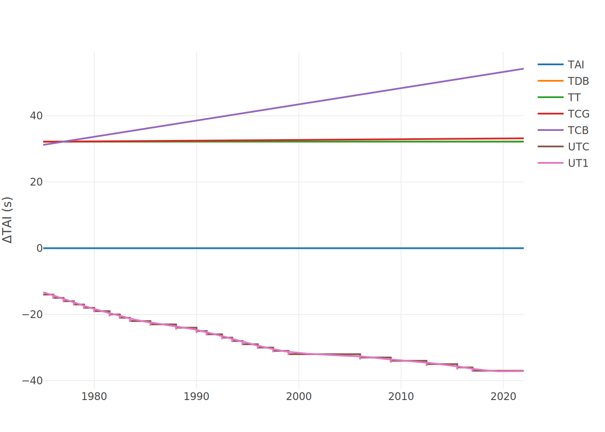

# [Tempo](@id basic_tempo)

The `Tempo` module is thought to be a fast, efficient and precise time transformation library
capable to handle the different transformations needed in the astronomical and astrodynamical 
application of the `Basic` library.

## Overview

There are different ways to represent an epoch within `Basic`, depending on the specific 
application. This section is here to help you choose the proper time representation and to 
present the capabilities of the module in trasforming time between different representations.

First of all, there is a deep difference in the way time is tought in the everyday life and when dealing with space-related applications. Whenever we say _the 12:35 of the 1st of January 2023_, we are merging two concepts: the calendar (_1st January 2023_) and the time representation (_12:35_).

#### Calendars
A calendar is a system of organizing days. This is done by giving names to periods of time, typically days, weeks, months and years. A date is the designation of a single and specific day within such a system. The simplest calendar system just counts time periods from a reference date. This applies for the _Julian day_ or Unix Time. Other calendars have multiple larger units of time. For example, calendars that contain one level of cycles:

 - year and ordinal date within the year – the _ISO 8601_ ordinal date system.

Or the common calendars with two levels of cycles:

- year, month, and day – most systems, including the _Gregorian calendar_, the _Islamic calendar_, the _Solar Hijri calendar_ and the _Hebrew calendar_.
- year, week, and weekday – e.g., the _ISO week date_.

#### Julian Calendar

The Julian day is the continuous count of days since the beginning of a Julian period. 
The Julian period is a chronological interval of 7980 years; year 1 of the Julian period was 
4713 BC (−4712). The Julian calendar year 2023 is year 6736 of the current Julian period. 
The next Julian Period begins in the year AD 3268.

#### Time & Scales

```@raw html
<p align="center">
    
</p>
```


## [API](@id basic_tempo_api)

### Types

```@meta
DocTestSetup = quote
    using Basic
end
```

```@autodocs
Modules = [Basic.Tempo]
Order = [:type]
```

### Functions

```@autodocs
Modules = [Basic.Tempo]
Order = [:function]
```

### Macros

```@autodocs
Modules = [Basic.Tempo]
Order = [:macro]
```

### Constants

```@autodocs
Modules = [Basic.Tempo]
Order = [:constant]
``` 