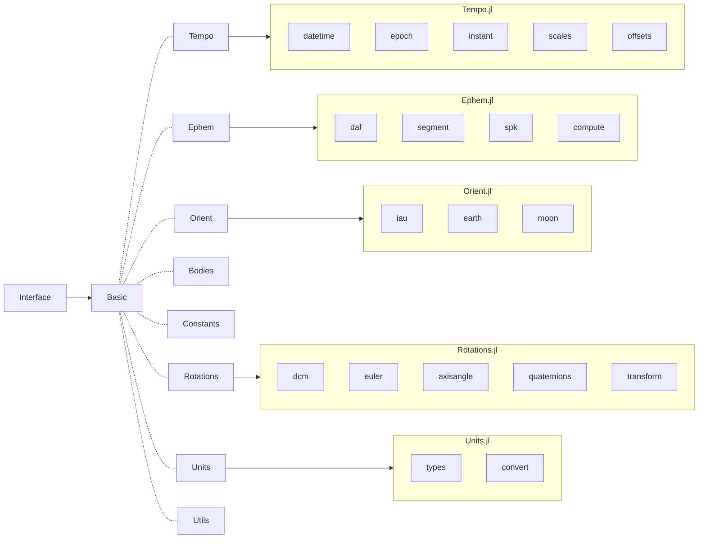

```mermaid
flowchart LR
     
    Basic -.- Tempo 
    Basic -.- Ephem
    Basic -.- Orient
    
    Basic -.- Bodies
    Basic -.- Constants
    Basic -.- Rotations
    Basic -.- Units
    Basic -.- Utils
    Interface --> Basic

    subgraph Tempo.jl
        datetime 
        epoch
        instant
        scales
        offsets
    end

    subgraph Orient.jl
        iau
        earth
        moon
    end

    subgraph Rotations.jl
        dcm 
        euler
        axisangle
        quaternions
        transform
    end

    subgraph Ephem.jl
        daf 
        segment
        spk
        compute
    end

    subgraph Units.jl
        types 
        convert
    end


    Tempo --> Tempo.jl
    Orient --> Orient.jl
    Rotations --> Rotations.jl
    Ephem --> Ephem.jl
    Units --> Units.jl

```