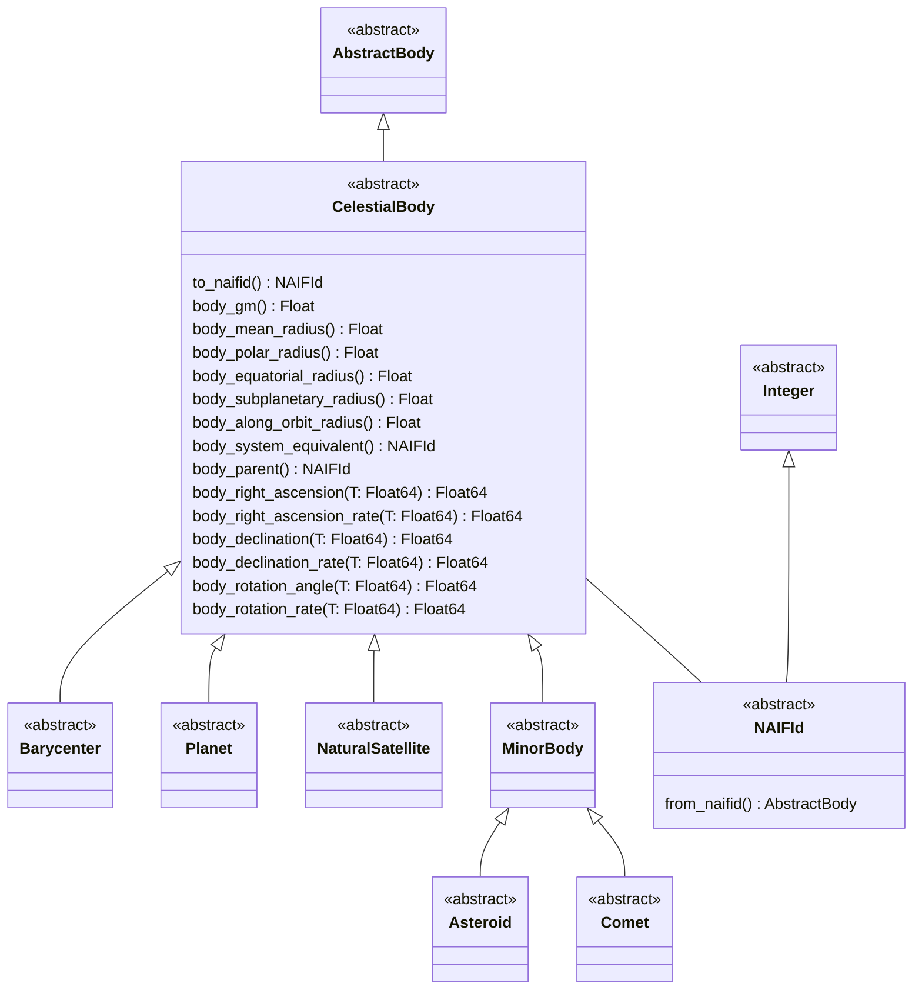

```mermaid
classDiagram

class AbstractBody{
    <<abstract>>
}

class CelestialBody{
    <<abstract>>
    to_naifid() NAIFId
    body_gm() Float
    body_mean_radius() Float
    body_polar_radius() Float
    body_equatorial_radius() Float
    body_subplanetary_radius() Float
    body_along_orbit_radius() Float
    body_system_equivalent() NAIFId
    body_parent() NAIFId
    body_right_ascension(T: Float64) Float64
    body_right_ascension_rate(T: Float64) Float64
    body_declination(T: Float64) Float64
    body_declination_rate(T: Float64) Float64
    body_rotation_angle(T: Float64) Float64
    body_rotation_rate(T: Float64) Float64
}

class Barycenter{
    <<abstract>>
}

class Planet{
    <<abstract>>
}

class NaturalSatellite{
    <<abstract>>
}

class MinorBody{
    <<abstract>>
}

class Asteroid{
    <<abstract>>
}

class Comet{
    <<abstract>>
}

AbstractBody <|-- CelestialBody
CelestialBody <|-- Barycenter
CelestialBody <|-- Planet
CelestialBody <|-- NaturalSatellite
CelestialBody <|-- MinorBody

MinorBody <|-- Asteroid
MinorBody <|-- Comet

Integer <|-- NAIFId

class NAIFId {
    <<abstract>>
    from_naifid() AbstractBody
}

class Integer {
    <<abstract>>
}

CelestialBody -- NAIFId 
```